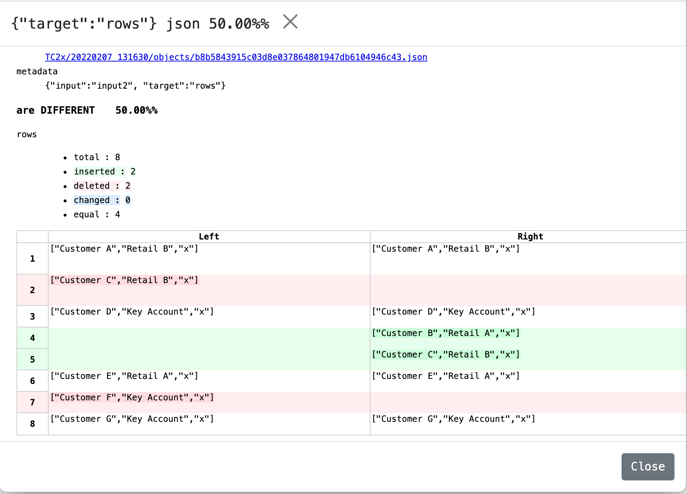

# Comparing 2 HTML &lt;TABLE>s in Katalon Studio

This is a small Katalon Studio project for demonstration purpose. You can download the zip of the project from the [Releases](https://github.com/kazurayam/ks_comparing_2_HTML_tables/releases) page, unzip it, and open it with your Katalon Studio.

This project is made in the hope to propose a solution to a topic in the Katalon Forum.

-   [Comparing 2 tables](https://forum.katalon.com/t/comparing-two-tables/62051/5)

@GIO Thank you for providing us sample data

This project was made and tested using Katalon Studio v8.2.5, but it should work with any KS version.

## Problem to solve.

Some Katalon Studio users want to compare data in 2 HTML tables found in the web page of their Application Under Test. Let me assume, I have 2 pages as follows:

The 2 tables looks similar. But you should be able to find some differences in the data contained.

They want to scrape data out of these 2 HTML `<TABLE>` tags, and compare them.

They want their test to be able to

1.  sort the rows of each tables with some reasonable keys. The above tables have a key which is a concatenation of 2 columns: "CUSTOMER" + "CHANNEL". Here we assume the key values are unique in the given data sets.

2.  find if any row key in the page1 is missing out of the page2.

3.  find if any row key in the page2 is missing out of the page1.

This is a **Frequently Asked Question** in the Katalon forum. So, I would present a runnable sample code for it.

## Fixture HTML

I made 2 HTML files and included in this project.

-   [page1](./Include/web/page1.html)

<!-- -->

    <!doctype html>
    <html lang="en">
    <head>
      <meta charset="utf-8">
      <title>tables</title>
      <meta name="description" content="The HTML5 Herald">
      <meta name="author" content="SitePoint">
      <link rel="stylesheet" href="css/styles.css?v=1.0">
    </head>
    <body>
      

        <table id="table1">
          <thead>
            <tr><th>CUSTOMER</th><th>CHANNEL</th><th>BRANCHES</th></tr>
          </thead>
          <tbody>
            <tr><td>Customer A</td><td>Retail B</td><td>x</td></tr>
            <!--
            <tr><td>Customer B</td><td>Retail A</td><td>x</td></tr>
            -->
            <tr><td>Customer C</td><td>Retail B</td><td>x</td></tr>
            <tr><td>Customer D</td><td>Key Account</td><td>x</td></tr>
            <tr><td>Customer E</td><td>Retail A</td><td>x</td></tr>
            <tr><td>Customer F</td><td>Key Account</td><td>x</td></tr>
            <tr><td>Customer G</td><td>Key Account</td><td>x</td></tr>
          </tbody>
        </table>
      

      <!--
      
      -->
    </body>
    </html>

-   [page2](./Include/web/page2.html)

<!-- -->

    <!doctype html>
    <html lang="en">
    <head>
      <meta charset="utf-8">
      <title>tables</title>
      <meta name="description" content="The HTML5 Herald">
      <meta name="author" content="SitePoint">
      <link rel="stylesheet" href="css/styles.css?v=1.0">
    </head>
    <body>
      

        <table id="table2">
          <thead>
            <tr><th>CUSTOMER</th><th>CHANNEL</th><th>BRANCHES</th></tr>
          </thead>
          <tbody>
            <tr><td>Customer A</td><td>Retail B</td><td>x</td></tr>
            <tr><td>Customer D</td><td>Key Account</td><td>x</td></tr>
            <tr><td>Customer B</td><td>Retail A</td><td>x</td></tr>
            <tr><td>Customer C</td><td>Retail B</td><td>x</td></tr>
            <tr><td>Customer E</td><td>Retail A</td><td>x</td></tr>
            <!--
            <tr><td>Customer F</td><td>Key Account</td><td>x</td></tr>
            -->
            <tr><td>Customer G</td><td>Key Account</td><td>x</td></tr>
          </tbody>
        </table>
      

      <!--
      
      -->
    </body>
    </html>

The Test Case `TC2` will open these 2 HTML files as `file:///` URL.

## Test Cases

I have made 3 Test Cases.

Test Case `TC1` is preparatory code. `TC1` contains 2 instances of `List<List<String>` filled with literals values, same as the screenshot images above.

Test Case `TC2` actually opens URL in web browser, scrape the HTML for the table data, constructs 2 instances of `List<List<String>>` filled with data scrape out of the web pages.

Both of `TC1` and `TC2` calls a separated Test Case `compare2datasets`. This code implements data manipulation and verifications.

### TC1

    import static com.kms.katalon.core.testcase.TestCaseFactory.findTestCase

    import com.kms.katalon.core.webui.keyword.WebUiBuiltInKeywords as WebUI

    /**
     * https://forum.katalon.com/t/comparing-two-tables/62051
     */

    List<List<String>> input1 = [
            [ "Customer A", "Retail B", "x" ],
            // [ "Customer B", "Retail A", "x" ],
            [ "Customer C", "Retail B", "x" ],
            [ "Customer D", "Key Account", "x" ],
            [ "Customer E", "Retail A", "x" ],
            [ "Customer F", "Key Account", "x" ],
            [ "Customer G", "Key Account", "x" ],
    ];

    List<List<String>> input2 = [
            [ "Customer A", "Retail B", "x"],
            [ "Customer D", "Key Account" , "x"],
            [ "Customer B", "Retail A" , "x"],
            [ "Customer C", "Retail B" , "x"],
            [ "Customer E", "Retail A" , "x"],
            // [ "Customer F", "Key Account" , "x"],
            [ "Customer G", "Key Account" , "x"]
            
    ];

    WebUI.callTestCase(findTestCase("compare2datasets"), ["data1": input1, "data2": input2])

### TC2

    import static com.kms.katalon.core.testcase.TestCaseFactory.findTestCase

    import java.nio.file.Path
    import java.nio.file.Paths

    import org.openqa.selenium.By
    import org.openqa.selenium.WebDriver
    import org.openqa.selenium.WebElement

    import com.kms.katalon.core.configuration.RunConfiguration
    import com.kms.katalon.core.webui.driver.DriverFactory
    import com.kms.katalon.core.webui.keyword.WebUiBuiltInKeywords as WebUI
    import com.kms.katalon.core.util.KeywordUtil

    Path projectDir = Paths.get(RunConfiguration.getProjectDir())
    Path webDir = projectDir.resolve("Include/web")

    URL page1 = webDir.resolve("page1.html").toFile().toURI().toURL()
    List<List<String>> t1 = getDataFromPage(page1, 'table1')

    URL page2 = webDir.resolve("page2.html").toFile().toURI().toURL()
    List<List<String>> t2 = getDataFromPage(page2, 'table2')

    WebUI.callTestCase(findTestCase("compare2datasets"), ["data1": t1, "data2": t2])

    /**
     * open URL in browser, scrape table data, return data as List<List<String>>
     * 
     * @param url 
     * @return List<List<String>> data collected from a <TABLE>
     */
    List<List<String>> getDataFromPage(URL url, String tableId) {
        List<List<String>> data = new ArrayList<>()
        WebUI.openBrowser("")
        WebUI.navigateToUrl(url.toString())
        WebDriver driver = DriverFactory.getWebDriver();
        WebElement table = driver.findElement(By.xpath("//table[@id='${tableId}']"))
        if (table != null) {
            data.addAll(scrapeDataOutOfTable(table))
        } else {
            KeywordUtil.markFailedAndStop("<table id=${tableId}> is not found in ${url}")
        }
        WebUI.closeBrowser()
        return data
    }

    List<List<String>> scrapeDataOutOfTable(WebElement table) {
        Objects.requireNonNull(table)
        List<List<String>> data = new ArrayList<>()
        List<WebElement> trList = table.findElements(By.xpath("tbody/tr"))
        if (trList != null) {
            for (WebElement tr in trList) {
                List<WebElement> tdList = tr.findElements(By.xpath("td"))
                List<String> row = new ArrayList<>()
                for (WebElement td in tdList) {
                    row.add(td.getText())
                }
                data.add(row)
            }
        }
        return data
    }

### compare2datasets

    import com.kms.katalon.core.util.KeywordUtil

    assert data1 != null
    assert data2 != null

    Map<String, Record> m1 = new TreeMap<>();
    for (List<String> row in data1) {
        Record rc = new Record(row[0], row[1], row[2]);
        m1.put(rc.key(), rc);
    }
    Set<String> keySet1 = m1.keySet()
    //println "keySet1: " + keySet1

    Map<String, Record> m2 = new TreeMap<>();
    for (List<String> row in data2) {
        Record rc = new Record(row[0], row[1]);
        m2.put(rc.key(), rc);
    }
    Set<String> keySet2 = m2.keySet()
    //println "keySet2: " + keySet2

    // print the datasets
    println "-------- data 1 --------"
    for (String key in keySet1) {
        println m1.get(key)
    }
    println ""
    println "-------- data 2 --------"
    for (String key in keySet2) {
        println m2.get(key)
    }
    println ""

    // comparing the key set of the input1 and the input2
    Set<String> s1 = new TreeSet<>(keySet1);
    Set<String> s2 = new TreeSet<>(keySet2);
    s1.removeAll(s2)
    if (s1.size() > 0) {
        for (String k1 in s1) {
            System.err.println "\"${k1}\" is contained in the data1, but is missing in the data2"
            
        }
        KeywordUtil.markFailed("data1 > data2")
    }

    println ""

    s1 = new TreeSet<>(keySet1);
    s2 = new TreeSet<>(keySet2);
    s2.removeAll(s1)
    if (s2.size() > 0) {
        for (String k2 in s2) {
            System.err.println "\"${k2}\" is contained in the data2, but is missing in the data1"
        }
        KeywordUtil.markFailed("data1 < data2")
    }

    /**
     *
     */
    class Record implements Comparable<Record> {
        private final String CUSTOMER;
        private final String CHANNEL;
        private final String BRANCHES;
        Record(String customer, String channel) {
            this(customer, channel, '');
        }
        Record(String customer, String channel, String branches) {
            this.CUSTOMER = customer.trim();
            this.CHANNEL = channel.trim();
            this.BRANCHES = branches.trim();
        }
        String CUSTOMER() {
            return this.CUSTOMER;
        }
        String CHANNEL() {
            return this.CHANNEL;
        }
        String BRANCHES() {
            return this.BRANCHES;
        }
        String key() {
            return this.CUSTOMER() + "|" + this.CHANNEL()
        }

        @Override
        boolean equals(Object obj) {
            if (! obj instanceof Record) {
                return false;
            }
            Record other = (Record)obj;
            return this.CUSTOMER() == other.CUSTOMER() &&
                    this.CHANNEL() == other.CHANNEL() &&
                    this.BRANCHES() == other.BRANCHES()
        }

        @Override
        int hashCode() {
            int hash = 7;
            hash = 31 * hash + this.CUSTOMER().hashCode();
            hash = 31 * hash + this.CHANNEL().hashCode();
            hash = 31 * hash + this.BRANCHES().hashCode();
            return hash;
        }

        @Override
        String toString() {
            return "[" + this.CUSTOMER() + "|" + this.CHANNEL() + "|" + this.BRANCHES() + "]";
        }

        @Override
        int compareTo(Record other) {
            int result = this.CUSTOMER() <=> other.CUSTOMER();
            if (result != 0) {
                return result;
            } else {
                result = this.CHANNEL() <=> other.CHANNEL();
                if (result != 0) {
                    return result;
                } else {
                    result = this.BRANCHES() <=> other.BRANCHES();
                    return result;
                }
            }
        }
    }

### Output

When I execute th `TC2`, I got the following output in the console.

    2022-02-05 00:00:42.187 INFO  c.k.katalon.core.main.TestCaseExecutor   - CALL Test Cases/compare2datasets
    2022-02-05 00:00:42.413 INFO  c.k.katalon.core.main.TestCaseExecutor   - (Default) input1 = []
    2022-02-05 00:00:42.485 INFO  c.k.katalon.core.main.TestCaseExecutor   - (Default) input2 = []
    -------- data 1 --------
    [Customer A|Retail B|abc]
    [Customer C|Retail B|ghi]
    [Customer D|Key Account|jkl]
    [Customer E|Retail A|lmn]
    [Customer F|Key Account|opq]
    [Customer G|Key Account|rst]

    -------- data 2 --------
    [Customer A|Retail B|]
    [Customer B|Retail A|]
    [Customer C|Retail B|]
    [Customer D|Key Account|]
    [Customer E|Retail A|]
    [Customer G|Key Account|]

    "Customer F|Key Account" is contained in the data1, but is missing in the data2

    2022-02-05 00:00:42.964 ERROR com.kms.katalon.core.util.KeywordUtil    - ❌ data1 > data2

    "Customer B|Retail A" is contained in the data2, but is missing in the data1

    2022-02-05 00:00:42.985 ERROR com.kms.katalon.core.util.KeywordUtil    - ❌ data1 < data2
    2022-02-05 00:00:42.991 ERROR c.k.katalon.core.main.TestCaseExecutor   - ❌ Test Cases/compare2datasets FAILED.
    Reason:
    com.kms.katalon.core.exception.StepFailedException: data1 > data2
        at com.kms.katalon.core.util.KeywordUtil.markFailed(KeywordUtil.java:19)
        at com.kms.katalon.core.util.KeywordUtil$markFailed.call(Unknown Source)
        at compare2datasets.run(compare2datasets:43)
      ...

## Discussion

I introduced several programming techniques.

1.  class `Record` to encapsulate data in a row of HTML table

2.  the Record has `getKey()` method that makes a combination of CUSTOMER+CHANNEL as the key which identifies a row of HTML table uniquely.

3.  use `java.util.TreeMap` to make a set of Record objects automatically sorted by the key; the Record class implements `int compareTo(Record)` method.

4.  use `java.util.Set` that provides `removeAll()` method which performs substitute operation of mathmatical set; the Record class implements `boolean equals(Object)` method.

Do you think this is unnecessarily complicated? I do not think so. This sample code is an absolute minimum to solve the problem that was asked to solve. The problem is a difficult one, it deserves this complexity.

However, I think that it is not a good idea to perform such full stack programming in an automated UI tests. I think such full stack programming should be carried out in the unit-tests for the web server app possibly using SQL; or the unit-tests for the JavaScript upon JSON data in the single page web app. I think automated UI test for HTML should NOT be responsible for this layer of problems.

## Conclusion

You should not try to write "compare 2 tables" in Katalon Studio. Too much complex UI automation code will not be well maintained long. Sooner or later (in a few months) it will break when the HTML design changed. Then you will remove the broken UI test out of the Test Suite. Your efforts will be in vain.

@author kazurayam
@date 4 Feb, 2022

## APPENDIX

I have got another solution to the problem how to compare 2 HTML tables. Let me explain.

Previously I developed and published a project named [Visual Inspection in Katalon Studio](https://forum.katalon.com/t/visual-inspection-in-katalon-studio-reborn/57440). This project can compare some pairs of web pages of a single Web application (e.g, the Production and the Development env) by taking screenshot images and scraping HTML source codes. The [materialstore](https://github.com/kazurayam/materialstore) library, on which the "Visual Inspection" project is built upon, has a good capability of making diff info of 2 text files. I found that the materialstore library is applicable to solve the "compare 2 tables" problem as well.

I made a sample that does the following steps:

1.  I developed a Test Case plus a Custom Keyword.

2.  The Test Case should navigate to URL of a web page with `<table>`. It will scrape the text `<table>` content and transform it to a Java object in the data type of `<List<List<String>>>` type.

3.  Repeat this for 2 URLs. You will get 2 objects.

4.  The Test Case will call your Custom Keyword. Your Keyword class should extend [`com.kazurayam.materialstore.textgrid.DefaultTextGridDiffer`](https://github.com/kazurayam/materialstore/blob/main/src/main/groovy/com/kazurayam/materialstore/textgrid/DefaultTextGridDiffer.groovy). This class implements `diffTextGrids()` method. Your Test Case will call this method while passing 3 parameters.

    -   the content of the 1st `<table>` in the data type of `List<List<String>>`

    -   the content of the 2nd `<table>` in the data type of `List<List<String>>`

    -   the variable in the type of `java.lang.nio.file.Path` that represents a file where the report will be written into

### Sample output

When you run "Test Cases/TC2x", you will find a HTML file created at `<projectDir>/store/TC2x-index.html`. See a sample in action:

-   [store/TC2-index.html](https://kazurayam.github.io/ks_comparing_2_HTML_tables/store/TC2x-index.html)

The diff of 2 `<table>` tags is nicely presented, isn’t it?

### Source code

-   [Test Cases/TC2x](Scripts/TC2x/Script1644159687647.groovy)

<!-- -->

    import java.nio.file.Path
    import java.nio.file.Paths

    import com.kms.katalon.core.configuration.RunConfiguration
    import com.kms.katalon.core.util.KeywordUtil
    import com.kms.katalon.core.webui.keyword.WebUiBuiltInKeywords as WebUI

    import your.ks.keyword.YourTextGridDiffer

    Path projectDir = Paths.get(RunConfiguration.getProjectDir())
    Path webDir = projectDir.resolve("Include/web")

    // open a web page in browser, scrape data out of a <table id="table1">
    URL page1 = webDir.resolve("page1.html").toFile().toURI().toURL()
    List<List<String>> t1 = YourTextGridDiffer.getDataFromPage(page1, 'table1')

    // open another web page in browser, scrape data out of a <table id="table2">
    URL page2 = webDir.resolve("page2.html").toFile().toURI().toURL()
    List<List<String>> t2 = YourTextGridDiffer.getDataFromPage(page2, 'table2')

    // convert data into JSON files, make the diff information, compile a report
    YourTextGridDiffer differ = new YourTextGridDiffer()
    int warnings = differ.diffTextGrids(t1, t2, "TC2x")

    WebUI.comment("the report is found at " + differ.getReportPathRelativeTo(projectDir))

    if (warnings > 0) {
        KeywordUtil.markWarning("found ${warnings} differences.")
    }

-   [Keyword/your.ks.keyword.YourTextGridDiffer](Keywords/your/ks/keyword/YourTextGridDiffer.groovy)

<!-- -->

    package your.ks.keyword

    import org.openqa.selenium.By
    import org.openqa.selenium.WebDriver
    import org.openqa.selenium.WebElement

    import com.kazurayam.materialstore.textgrid.DefaultTextGridDiffer
    import com.kms.katalon.core.util.KeywordUtil
    import com.kms.katalon.core.webui.driver.DriverFactory
    import com.kms.katalon.core.webui.keyword.WebUiBuiltInKeywords as WebUI

    class YourTextGridDiffer extends DefaultTextGridDiffer {

        /**
         * open a URL in browser, scrape table data, return data as List&lt;List&lt;String>>
         *
         * @param url
         * @return List&lt;List&lt;String>> data collected from a &lt;table>
         */
        public static final List<List<String>> getDataFromPage(URL url, String tableId) {
            List<List<String>> data = new ArrayList<>()
            WebUI.openBrowser("")
            WebUI.navigateToUrl(url.toString())
            WebDriver driver = DriverFactory.getWebDriver();
            WebElement table = driver.findElement(By.xpath("//table[@id='${tableId}']"))
            if (table != null) {
                data.addAll(scrapeDataOutOfTable(table))
            } else {
                KeywordUtil.markFailedAndStop("<table id=${tableId}> is not found in ${url}")
            }
            WebUI.closeBrowser()
            return data
        }

        /**
         * scrape data out of a &lt;table&gt;
         */
        private static final List<List<String>> scrapeDataOutOfTable(WebElement table) {
            Objects.requireNonNull(table)
            List<List<String>> data = new ArrayList<>()
            List<WebElement> trList = table.findElements(By.xpath("tbody/tr"))
            if (trList != null) {
                for (WebElement tr in trList) {
                    List<WebElement> tdList = tr.findElements(By.xpath("td"))
                    List<String> row = new ArrayList<>()
                    for (WebElement td in tdList) {
                        row.add(td.getText())
                    }
                    data.add(row)
                }
            }
            return data
        }
    }

Please note that `YourTextGridDiffer` class extends [`com.kazurayam.materialstore.textgrid.DefaultTextGridDiffer`](https://github.com/kazurayam/materialstore/blob/main/src/main/groovy/com/kazurayam/materialstore/textgrid/DefaultTextGridDiffer.groovy) which encapsulates all detail processing, which include:

1.  the code is given with 2 Java objects of `<List<List<String>>>` type; it will transform them into JSON texts

2.  the code makes the diff of 2 JSON texts using [java-diff-utils](https://java-diff-utils.github.io/java-diff-utils/)

3.  the code compiles a report in HTML format.
